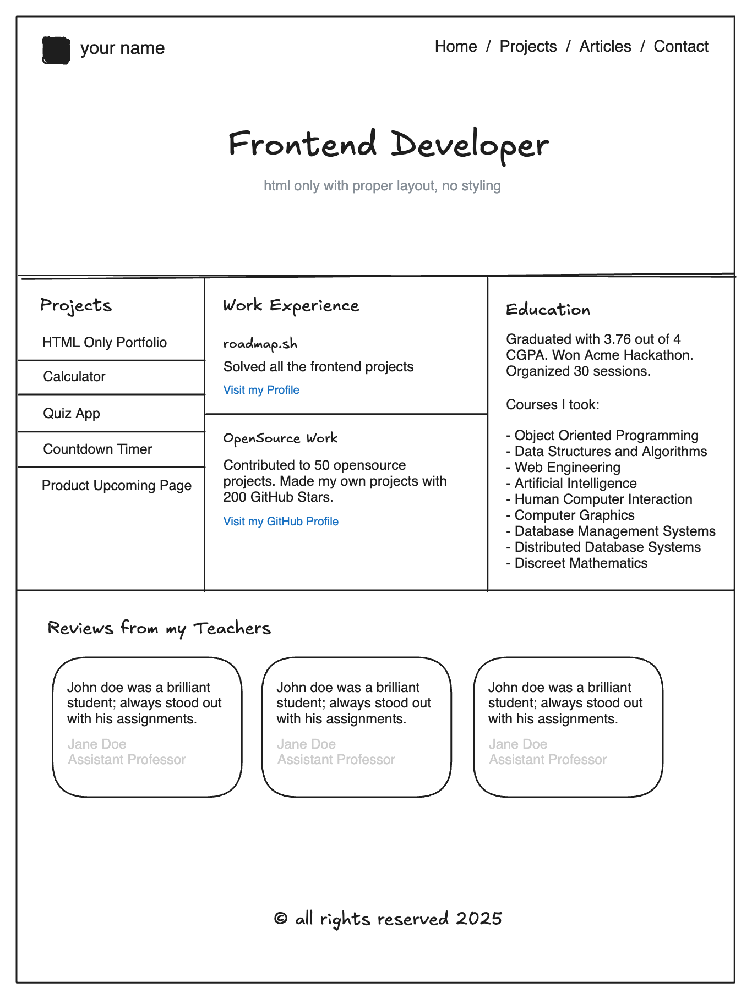

# Frontend-Projects

This repository contains front-end projects built following the [roadmap.sh](https://roadmap.sh/) front-end developer path.

## Single Page Cv

Create a single page HTML CV to showcase you care history

### Key requirements for this project:

- Semantic HTML: Use appropriate HTML tags to structure your CV.
- SEO Meta Tags: Include essential meta tags for SEO.
- Open Graph (OG) Tags: Add OG tags for better social media sharing.
- Favicon: Add a favicon for your CV page.

The structure of your CV should be easily understandable and ready for styling in a future project.

### Submission Checklist:

- Semantically correct HTML structure.
- Single-page layout with sections for education, skills, and career history.
- SEO meta tags in the head section.
- OG tags for better social media sharing.
- A favicon linked in the head section.

By completing this project, you’ll gain a solid understanding of how to create a single-page CV using HTML, apply basic SEO principles, and prepare your webpage for future styling. This foundation will enable you to move on to styling the CV using CSS in subsequent projects.

## Basic HTML Website

> Goal of this project is to teach you how to structure a website using HTML i.e. different sections of a website like header, footer, navigation, > > main content, sidebars etc. Do not style the website, only focus on the structure. Styling will be done in separate projects.

In this project, you are required to create a simple HTML only website with multiple pages. The website should have following pages:

- Homepage
- Projects
- Articles
- Contact

The website should have a navigation bar that should be present on all pages and link to all the pages.

You are not required to style the website, you are only required to create the structure of the website using HTML. Goals of this project are:

- Learn how to create multiple pages in a website.
- Structure a website using HTML in a semantic way.
- Structure in a way that you can easily add styles later.
- Add SEO meta tags to the website.

You can use the following mockup example to create the structure of the website (remember, you are not required to style the website, only focus on the structure that you can style later):

Again, make sure that your submission includes the following:

- Semantically correct HTML structure.
- Multiple pages with a navigation bar.
- SEO meta tags in the head of each page.
- Contact page should have a form with fields like name, email, message etc.

After completing this project, you will have a good understanding of how to structure a website using HTML, basic SEO meta tags, HTML tags, forms etc. You can now move on to the next project where you will learn how to style this website using CSS.

## Nombre de tu Proyecto

Repository URL: https://github.com/luissergiovaldivia52/Frontend-Projects/tree/main/BasicHTMLWebsite

## Personal Portafolio

> The Goal of this project is to teach you how to style a website using CSS. You will take the structure from
> the previous HTML-only-proyect and apply various CSS techniques to enhance its appareance and
> responsiveness.

In this project, you will styles the HTML website struture you created previously in a diferent project. The focus will be on learning how to use CSS to create responsive
layouts, apply color and typography, and enhance the overall design of your website.

Rough mockups of the website structure for mobile and desktop device are given below. Do not worry about the design details i.e. colors backgroups etc at this stage; we are not looking for a beautiful design, but a well-structured and responsive website. Just focus on making the layout same as the mockup and ensuring it looks good on diferent screen sizes.

### Submission Requierements:

Your submission should include:

- A fully styled, responsive website with the same structure as the previous project.
- Consistent use of a chosen color shceme and typography.
- Prosper use of CSS technique like Flexbox, media queries, and the box model.
- A responsive navigation bar and well-styled contact from.

### Bonus Points

For Bonus Points, you can:

- Use Google Fonts to enhance the typography of your website.
- Look into [GitHub Pages](https://pages.github.com/) or [Cloudflare Pages](https://pages.cloudflare.com/) to host your website for free.
- Add support for dark mode using CSS variables.
